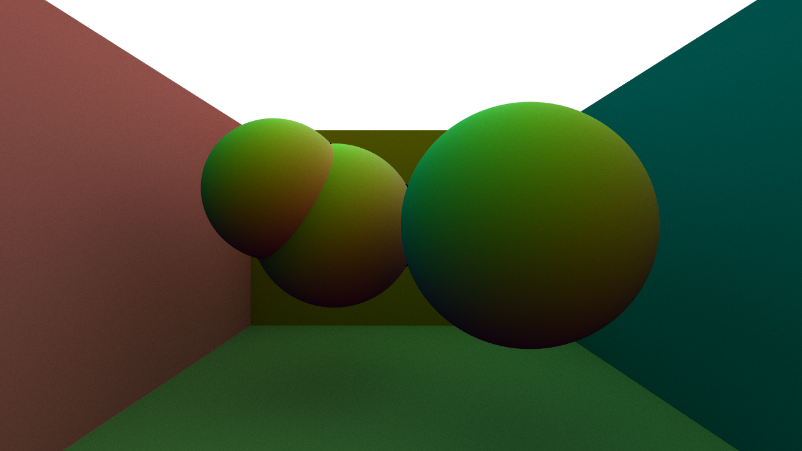

# Yet another path tracer

Yet another GPU accelerated toy path tracer, but everything is written in Rust (:rocket:) - both the GPU and CPU code. Uses [rust-gpu](https://github.com/EmbarkStudios/rust-gpu) to transpile Rust (:rocket:) code to SPIR-V, and then uses [wgpu](https://github.com/gfx-rs/wgpu) to execute that SPIR-V. 

# Features
- Simple GPU accelerated path tracing.
- Supports PBR materials with roughness/metallic workflow. These can be set on a per-mesh basis.
- Supports texture mapping. Can load albedo, normal, roughness and metallic maps from scene file.
- Ray intersections are made fast using a [BVH](https://en.wikipedia.org/wiki/Bounding_volume_hierarchy) built in a binned manner using the [surface area heuristic](https://en.wikipedia.org/wiki/Bounding_interval_hierarchy#Construction).
- Convergence rate is improved by the use of a [low-discrepancy sequence](http://extremelearning.com.au/unreasonable-effectiveness-of-quasirandom-sequences/) in place of uniform random sampling.
- Uses [assimp](https://github.com/assimp/assimp) for scene loading, so can load many scene and model file formats, such as glTF, FBX, obj, etc.
- Uses a nice procedural atmospheric skybox (thanks @nyrox).
- Cross platform. Tested on Windows 10 and Arch Linux.
- All the GPU code can be run on the CPU for debugging purposes. I don't have a nice workflow for this other than editing the code yet, though.

# How to build and run
```sh
# builds without denoising support
cargo run
```

The path tracer optionally supports denoising via OpenImageDenoise, via feature flag `oidn`. To use this feature, first [install OpenImageDenoise](https://www.openimagedenoise.org/downloads.html) and ensure that the `OIDN_DIR` environment variable points to your install location.

```sh
# with denoising (requires OIDN to be installed and available on PATH)
export OIDN_DIR <path_to_oidn_install>
cargo run -F oidn
```

Once built and launched, to start rendering, simply drag any compatible scene file onto the window, or use the file picker. Holding right click and using WASD will let you move the camera.

I've only tested using Vulkan. If `wgpu` for whatever reason defaults to a different backend on your system, you can fix this by setting the `WGPU_BACKEND` environment variable to `"vulkan"`.

GPU kernel code is in `kernels/`, code shared between GPU and CPU is in `shared_structs/`, pure CPU code is in `src/`.

# Pretty pictures



